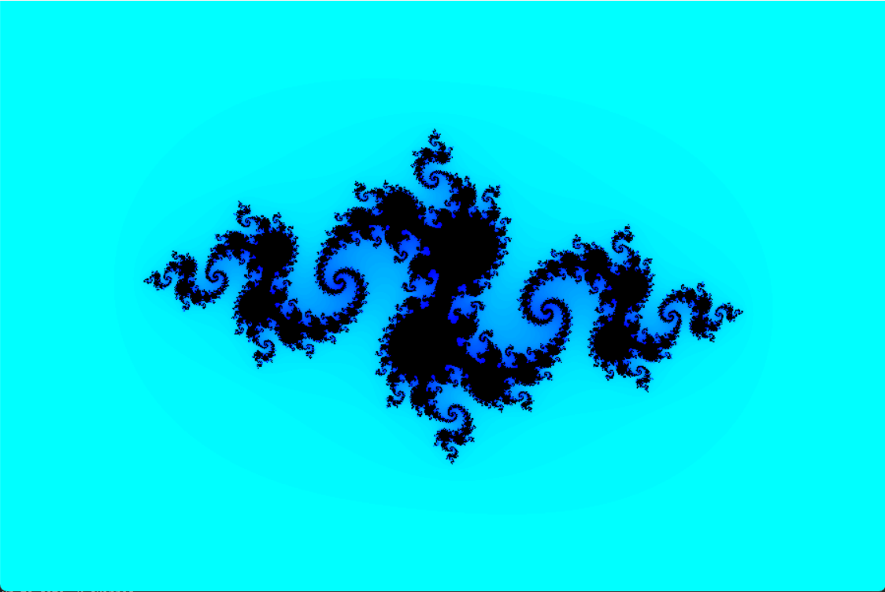

# fractal-fashion - Julia Set Renderer in C + SDL2

### Overview

**Fractal Fashion** is a simple exploration of fractal geometry, implemented from scratch in **C** using the **SDL2** library for visualization.
This renderer procedurally generates complex fractals by iteratively evaluating `z(n+1) = z(n)^2 + c` over a discretized complex plane, where each pixel maps to a unique complex coordinate. The escape-time algorithm determines divergence `(|z| > 2)` to produce self-similar, topologically rich structures, while iteration counts are converted via a custom HSL -> RGB pipeline in C to yield smooth, vivid gradients enhancing perceptual detail. 

The goal of this project was to learn:

* How floating-point math and complex number operations translate into pixel rendering.
* How graphical output pipelines work at a low level using software rendering.
* How color mapping (via HSL to RGB conversion) affects visual clarity and gradient smoothness.

---

## 📸 Demo


More stunning visuals with mouse interactions: https://m16.neocities.org/fractal-fashion#!

---

### Features

* **Pure C implementation** (no external math or graphics engines).
* **Software-based pixel plotting** using SDL2.
* **Mouse-controlled zoom** to explore fractal details dynamically
* **Mouse pointer modifies Julia set constant** `c` in real time
* **Configurable constants** for different Julia set variations.
* **Smooth color gradients** via HSL → RGB conversion.
* **Simple keyboard/mouse zoom controls** (optional, if you’ve added them).

---

### Technical Notes

* Each pixel represents a complex coordinate `(x + yi)` mapped from screen space.
* Iteration limit and escape radius determine convergence and visual density.
* Interactive features: moving the mouse updates the `c` parameter of the Julia set and scroll wheel or mouse buttons control zoom level.
* HSL-based coloring ensures smoother hue transitions compared to raw RGB mapping.
* The renderer runs entirely on CPU — no GPU acceleration or SIMD optimizations (yet).

---

### Build & Run

```bash
gcc fractal_fashion.c -lSDL2 -lm -o fractal_fashion
./fractal_fashion
```

Requires:

* **SDL2 development libraries**
* **GCC/Clang** on Linux or MinGW on Windows

---

### Learning Outcome

This project helped me understand:

* The numerical precision issues in iterative rendering.
* How to handle performance trade-offs in software-based visualization.
* How to build a simple rendering pipeline using SDL.

---

### Future Improvements

* Add SIMD acceleration (SSE/AVX) for faster iteration loops.
* Implement smooth zoom transitions and parameter morphing.
* Port to Vulkan or DirectX for GPU-based fractal exploration.

---
